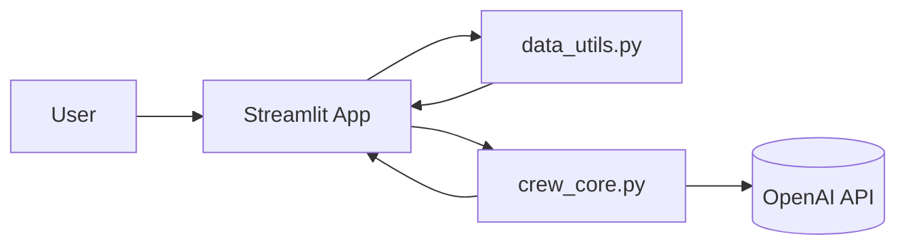

# Hotel Crew AI Assistant — CrewAI × Streamlit

[](https://www.python.org/)  
[](https://streamlit.io/)  
[](https://www.crewai.com/)  
[](LICENSE)  
[](https://github.com/sianglin0528/Hotel_Crew_AI_RoadMap)  

---

An AI assistant for hotel **Revenue Management System (RMS)** use cases, built with **CrewAI multi-agent orchestration** + **Streamlit interactive UI**.  
This project is documented using the **CRISP-DM framework**.  

---

## 0. TL;DR

- **Agents**: Customer / Forecast / Pricing / Response  
- **Data**: `occupancy_history.csv (date, occupancy_pct)`  
- Run `streamlit run streamlit_app.py` → Ask a guest-style question → Get **bilingual (Chinese + English)** response  
- Methodology: **CRISP-DM** (Business → Data → Prep → Modeling → Evaluation → Deployment)  

---

## 1. Business Understanding

Hotels need to quickly answer questions like:  
**“How much will a double room cost next week?”**  

This involves:  
- Forecasting next week’s **occupancy rate** (with event/seasonal effects)  
- Adjusting **dynamic pricing** based on occupancy + competitor rates  
- Delivering a **professional bilingual response** to guests  

**Goal**: Automate the above process to save time, improve consistency, and boost revenue management efficiency.  

---

## 2. Data Understanding

- Primary dataset: `sample_data/occupancy_history.csv`  
  - Columns: `date`, `occupancy_pct`  
- Supporting parameters: Lookback days, seasonal/event adjustment (%), competitor price range (USD)  

> Future expansion: multiple room types, competitor web scraping, event calendar integration.  

---

## 3. Data Preparation

- `data_utils.py`:  
  - `load_occupancy_csv(path)`: Load, parse, sort occupancy data  
  - `simple_occupancy_forecast(df, lookback_days, boost)`: Moving average forecast + adjustment  
  - `dynamic_price_suggestion(occupancy, comp_min, comp_max)`: Price range suggestion with positioning  

---

## 4. Modeling

### 4.1 Multi-Agent Orchestration (CrewAI)

- **Customer Service Agent** → Understand guest request  
- **Forecast Analyst** → Estimate occupancy rate  
- **Pricing Analyst** → Suggest price range & positioning  
- **Response Agent** → Deliver final bilingual answer  

#### Pipeline
```mermaid
graph TD
    T1[Understand request\n(Customer)] --> T2[Forecast occupancy\n(Forecast)]
    T2 --> T3[Dynamic pricing\n(Pricing)]
    T3 --> T4[Final bilingual response\n(Response)]
```

### 4.2 System Architecture
```
Hotel_Crew_AI_RoadMap/
├── crew_core.py        # Agents + Tasks + run_crew()
├── data_utils.py       # Data prep & pricing logic
├── streamlit_app.py    # Streamlit UI
├── sample_data/        # Example CSV
├── .env                # OPENAI_API_KEY=...
└── requirements.txt
```



---

## 5. Evaluation

- Baseline: Forecasts should align with historical averages ± adjustments  
- Price range within competitor band; labeled “slightly lower / aligned / slightly higher”  
- Responses are clear, professional, bilingual, and include a call-to-action (book/upgrade)  

Future metrics:  
- Response latency (s)  
- Booking conversion rate / ADR lift  
- Human workload reduction  

---

## 6. Deployment

### 6.1 Quick Start
```bash
# 1. Setup environment
python -m venv venv
source venv/bin/activate        # Windows: venv\Scripts\activate
pip install -r requirements.txt

# 2. Set API key
echo "OPENAI_API_KEY=sk-xxxx" > .env

# 3. Run
streamlit run streamlit_app.py
```

### 6.2 GitHub
```bash
printf "__pycache__/\nvenv/\n.env\n*.pyc\n.streamlit/\n" > .gitignore
git init && git add -A && git commit -m "init"
git branch -M main
git remote add origin https://github.com/<you>/Hotel_Crew_AI_RoadMap.git
git push -u origin main
```

---

## 7. UI Walkthrough

1. Upload `occupancy_history.csv` or use sample  
2. Adjust parameters: Lookback / Event boost (%) / Competitor price bounds  
3. View **occupancy forecast & dynamic pricing**  
4. Enter guest-style question (e.g., *How much is a double room next week with mountain view?*)  
5. Click **🚀 Generate CrewAI Response** → See **Chinese + English reply**  

---

## 8. Roadmap

- [ ] Stronger forecasting models (Prophet / sktime / XGBoost)  
- [ ] Multi-room type pricing (Standard / Deluxe / Suite)  
- [ ] Upsell suggestions (Breakfast, late checkout, upgrades)  
- [ ] Save conversation logs (SQLite / Postgres)  
- [ ] Slack / Notion integration  
- [ ] Deploy to Streamlit Cloud / HF Spaces  

---

## 9. Example Output

> **中文**  
> 親愛的客人您好… 建議價格區間為 **USD 130–160**。此建議基於當前入住率約 **81.6%**…  
>
> **English**  
> Dear Guest… Our suggested price range is **USD 130–160** based on the current occupancy (~**81.6%**). …  

---

## 10. Environment Variables

`.env`
```
OPENAI_API_KEY=sk-xxxxx
OPENAI_MODEL=gpt-4o-mini  # optional
```

---

## 11. Main Entry Point

```python
# streamlit_app.py (excerpt)
from data_utils import load_occupancy_csv, simple_occupancy_forecast, dynamic_price_suggestion
from crew_core import run_crew

out = run_crew(user_q, facts)   # returns final bilingual response
```

---

## 12. License & Credits

- Code: MIT  
- Thanks: OpenAI / Streamlit / CrewAI community  

---

Author: **SiangLin (Hotel Assistant Manager → Data Engineer)**  
This project demonstrates how AI multi-agent systems can be applied in **real hotel revenue management scenarios**. 🚀  
